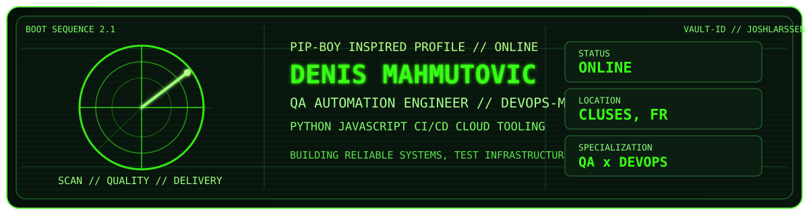
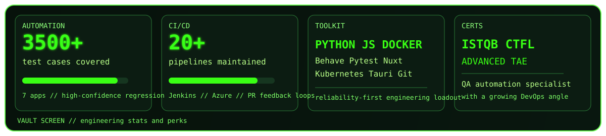

<p align="center">
  
</p>

<p align="center">
  
  
  
  
</p>

```console
> booting vault profile...
> user: Denis Mahmutovic
> class: QA Automation Engineer / DevOps-minded builder
> objective: build resilient test systems, delivery pipelines and sharp side projects
```

<table>
  <tr>
    <td valign="top" width="50%">

## `STATUS`

- `5+ years` in QA automation and software quality
- `3,500+` automated tests across `7` applications
- `20+` CI/CD pipelines maintained and improved
- Building robust tooling for IoT product validation
- Moving toward a stronger `QA x DevOps` hybrid profile

   </td>
    <td valign="top" width="50%">

## `PERKS`

- `ISTQB CTFL`
- `ISTQB Advanced Test Automation Engineer`
- `Python`, `JavaScript`, `C`, `C++`
- `Behave`, `Pytest`, `Jenkins`, `Docker`, `Kubernetes`
- `Nuxt`, `Tauri`, `Azure`, `Git`, `SonarQube`

   </td>
  </tr>
</table>

<p align="center">
  
</p>

## `QUEST LOG`

- [x] Build reliable automation stacks for real products
- [x] Wire tests directly into CI/CD feedback loops
- [x] Support teams with tooling, quality practices and platform workflows
- [ ] Push more public open-source work into the profile
- [ ] Ship more polished tools with a stronger product feel

## `LOADOUT`


## `FEATURED BUILDS`

### [`behave-toolkit`](https://github.com/joshlarssen/behave-toolkit)

> A Python toolkit that extends the `Behave` testing workflow with practical quality-of-life features.

### `GestureSnap`

> Gesture-based shortcut launcher built with `Nuxt 4`, `TypeScript`, `Tauri 2`, and `Rust`.

### `Somfy automation work`

> Designed and scaled a Python-based automated validation environment that improved release confidence and accelerated feedback for connected products.

## `CAREER LOG`

```text
[ SOMFY ]         QA Automation Engineer
[ AZURE/JENKINS ] Backup DevOps responsibilities
[ INSA LYON ]     Telecom engineering background
[ OPEN SOURCE ]   More public builds loading soon...
```

## `SYSTEM METRICS`

<p align="center">
  
  
</p>

```console
> signal stable
> profile theme: vault terminal / soft radiation green
> next upgrade: more public projects + CV uplink
```
